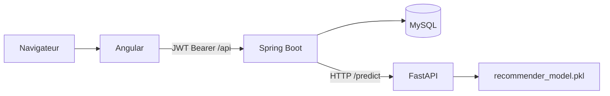
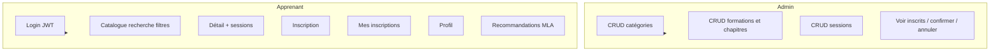
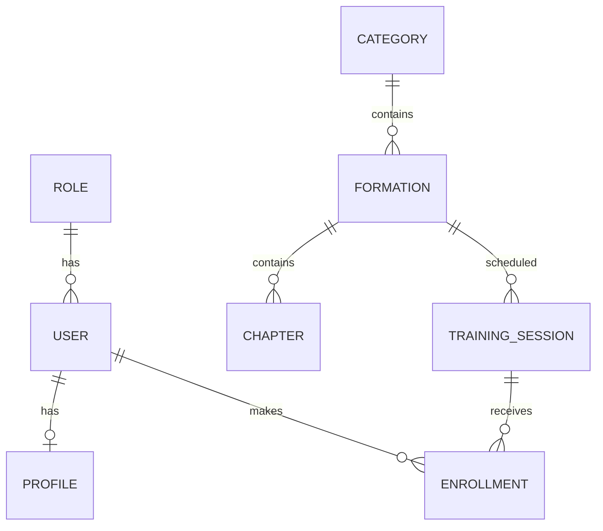
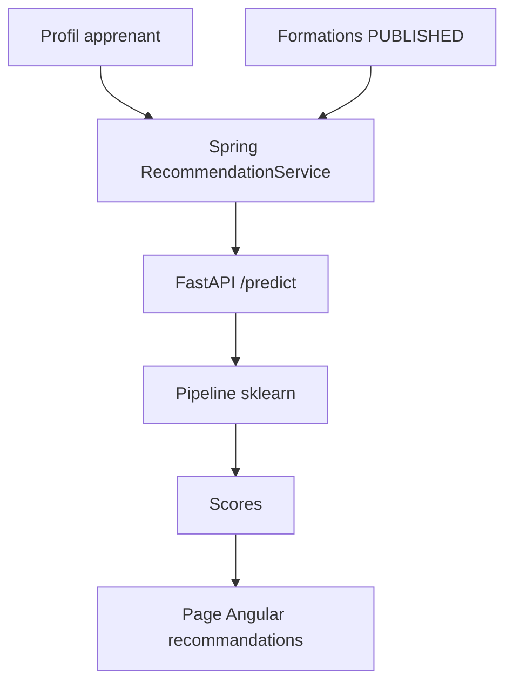
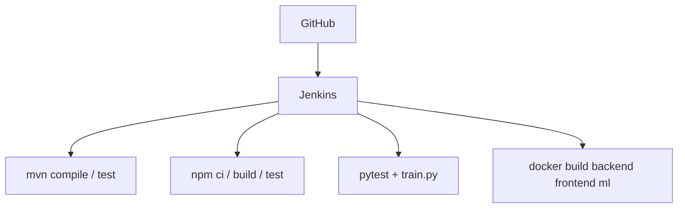

# Architecture FormaLearn

## Architecture principale (validation)



```
Angular → Spring Boot → MySQL
Spring Boot → FastAPI (scikit-learn) → recommandations
GitHub → Jenkins → build / tests → SUCCESS ou FAILURE
```

Authentification : **Spring Security + JWT** (rôles `ADMIN` / `APPRENANT`).

Entre conteneurs Docker : `mysql`, `backend`, `ml`, `frontend`. Le backend n’utilise **jamais** `localhost` pour JDBC ou le ML.

## Phrase pour le professeur

« Notre application utilise Angular pour le frontend et Spring Boot pour le backend. Spring Security avec JWT gère l’authentification et les rôles. MySQL stocke les données des deux modules. La partie MLA utilise un service Python avec scikit-learn pour recommander des formations. Jenkins automatise le build et les tests dans une pipeline CI. »

## Cas d'utilisation



## Modèle de données (simplifié)



## Architecture MLA



## DevOps



Jenkins : `jenkins/docker-compose.yml` (port **9090**).  
Stack applicative : `docker-compose.yml` à la racine.
